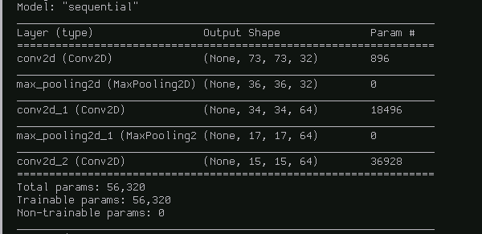
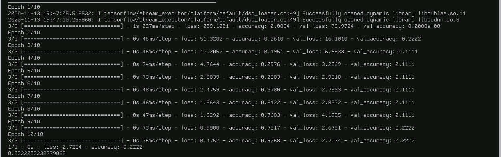
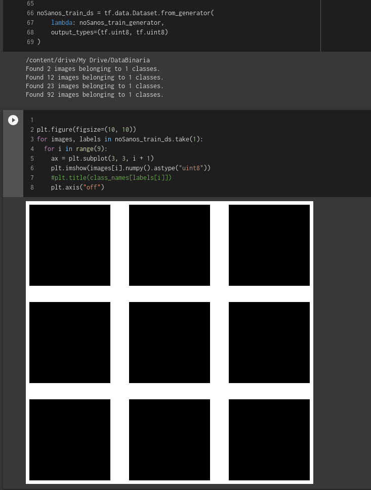

# Buscar Data 
 + [dentistry iowa university](https://www.dentistry.uiowa.edu/oprm-atlas)
 + [Color photo atlas of dentistry](https://www.nycdentist.com/more/dental-photos/)
 + [DermNet NZ](https://www.dermnetnz.org/topics/mouth-problems/)
 + [Images and Media - UCSF Library](https://guides.ucsf.edu/c.php?g=100976&p=655198)
 + [Oral Disease Picture Gallery HardinMD UIOWA](https://web.archive.org/web/20170213170558/http://hardinmd.lib.uiowa.edu/dentpictures2.html)
 + [Stanford BioImage Search](https://lane.stanford.edu/search.html?q=Mouth&source=rl-images-all&auto=no&page=15)

# Investigar métodos CNN
 + LeNet
 + AlexNet
 + VGGNet
 + GoogLeNet
 + ResNet
 + ZFNet
 + Single Shot Multibox Detector (SSD) ?
 + Region-based CNN (R-CNN) ?
 + Faster R-CNN ?
 + Mask R-CNN ?
 + Fully Convolutional Neural Network (FCN) ?
 + ResNeXts
 + Xception
 + Inception

Separar imagenes en conjunto de pruebas, validacion.

Sintetizar entrada.

Avanzar en memoria, estado del arte, modelos que hayan funcionado bien, cercano al problema (uno o dos parrafos). (revisar y ayudarse en paperswithcode.com)

Entrenar la red convolucional con los pocos datos que tenemos va a resultar en un sobreajuste, la técnica de Data Augmentation nos puede ayudar a resolver este problema y Keras tiene herramientas que nos pueden ayudar para esto [Link](https://towardsdatascience.com/classify-butterfly-images-with-deep-learning-in-keras-b3101fe0f98).

[Keras image preprocessing](https://keras.io/api/preprocessing/image/)

paperswithcode.com browse state of the art, entrega los papers con el código (duh..)

En el paper Detection and diagnosis pf dental caries using a deep learning-based convolutional neural network algorithm usaron una red GoogLeNet Inception v3 CNN pre-entrenada para el preprocesamiento, y los datasets fueron entrenados usando transfer learning. Un total de 9 modulos de inception fueron usados, incluyendo un clasificador auxiliar, dos capas totalmente conectadas, y funciones de softmax. "The training set was separated randomly into 32 batches for every epoch, and 1000 epochs were run at a learning rate of 0.01. To provide better detection of dental caries, fine tuning was used to optimize the weights and improve the output power by adjusting the hyperparameters"

Buscar y leer el paper Deep Learning for Automated Detection of Cyst and Tumors of the Jaw in Panoramic Radiographs

Documento importante de [Análisis de situación de salud bucal](https://web.minsal.cl/sites/default/files/files/An%C3%A1lisis%20de%20Situaci%C3%B3n%20Salud%20Bucal%20final%20pdf.pdf) del Minsal

Esta es la primera arquitectura usada para el modelo:

Y estos son los resultados obtenidos con ella:

Probar diferentes tamaños de batch, aumentar batch size, disminuir batch size. También probar con diferentes optimizadores.

Buscar sobre redes generativas adversas (GAN) para crear data artificial.

Se probaron valores de batch size de 32, 64 y 91 (totalidad del dataset), teniendo resultares similares en todos ellos.

Uno de los posibles problemas es el dataset que fue confeccionado y que es usado actualmente, ya que tiene grandes desbalances entre algunas clases, no se tiene seguridad de que las imágenes pertenezcan efectivamente a dichas clases y probablemente se tienen muchas clases que no sirven.

# To-do de la semana
+ Aplicar modelos sobre los nuevos datos
+ Ver clasificación con sujeto sano y enfermo (2 clases, clasificación binaria)
+ Ver la aplicabilidad de la transformación de Fourier como pre-procesamiento de los datos
+ Investigar modelos generativos progresivos para la data augmentation

## Aplicar modelos sobre los nuevos datos:
Al aplicar el primer modelo con los nuevos datos se puede observar instantáneamente una mejora en los resultados.

## Utilizar Validación cruzada estratificada para clasificación binaria
Se presentaron problemas al implementar stratified Kfold CV al haber usado la función image_dataset_from_directory de la api de keras de tensorflow

# To do
* Elegir modelos (y probarlos..?)
** buscar en literatura (?)
* Hacer marco teórico de la memoria
* Agregar patologías y cosas relacionadas a la salud bucal en el marco teórico
* plotear métricas en cada fold de la CV

## plotear métricas en cada fold de la CV 
ldeep learningos valores de las métricas se ven bien pero las curvas son bastante zigzagueantes por lo que se piensa que el dataset, con 129 fotos, aún es muy pequeño. Intenté usar regularizadores de kernel l2 en las capas convolucionales, agregar una capa de dropout y ajustar el ratio de aprendizaje del optimizador (Adam) pero las curvas del modelo siguen viéndose con bastante ruido, por lo que se tiene pensado intentar usar data augmentation y posiblemente implementar un modelo GAN para esto.

## posibles modelos para elegir 
CNN, AlexNet, VGG16, VGG, CNN-LSTM, unet, GoogLeNet, InceptionV3, VGG19, FCN

# Bitácora 23 de Abril 2021
Problemas con respecto a la implementación de la GAN. El problema se tiene con cargar las imágenes como datasets, en especifico con la función from_generator para crear un dataset a partir de una función generadora. Se creó un dataset de esta manera pero al tratar de usar este en funciones o al acceder a sus elementos no se obtiene nada, al imprimir las imágenes del dataset para revisar si hay algún problema o no se obtuvieron imágenes en negro.

In 'Automatic diagnosis of dental diseases using convolutional neural network and panoramic radiographic images' paper:
The number of learnable parameters must be considered in training a convolutional neural network because more training. This could prolong the training time and intensify the need for training data. Having approximately 60 million parameters, AlexNet needs more training; therefore, the overfitting problem prevents researchers from achieving the right solution due to the limited data. After different networks were analysed and tested, GoogleNet was selected as the main network for dental diagnosis due to the inception module features and reduction of parameters as erll as simplicity.
